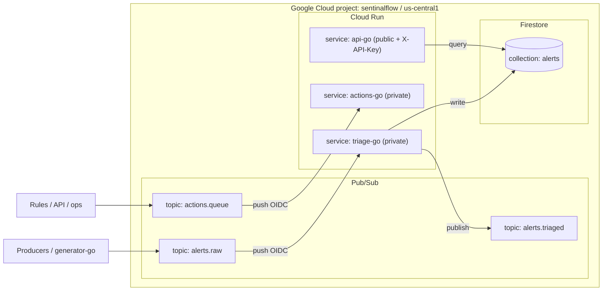

# Sentinelflow

**Production-style reference architecture for security event ingestion, triage, actioning, and query on Google Cloud.**

**Live demo:** [console-next Alerts](https://console-next-zeweituzpq-uc.a.run.app/alerts)

---

## What it delivers

* **Event ingestion → triage → storage → action → query** with Google Cloud primitives.
* **Zero-trust service-to-service auth**: Pub/Sub **push** to private Cloud Run via **OIDC** with audience binding.
* **Deterministic triage**: lightweight ML classifier (Naive Bayes) trained from labeled samples; reason tokens + confidence.
* **At-least-once processing** with **idempotent** writes to Firestore and **dead-letter queues** for malformed traffic.
* **Action execution** (e.g., Slack) decoupled from triage; status transitions via read-only API and action queue.
* **API + Console**: API-key protected read endpoints and a Next.js UI for browsing and approving alerts.
* **Operational hooks**: manual replay, safe seeding/generation, clean re-wires, and explicit logging of decisions.

---

## System diagram



---

## Technical overview

### Services

* **triage-go (private)**
  Input: `alerts.raw` (Pub/Sub push).
  Logic: parse event → classify (severity, confidence, reasons) → **idempotent upsert** to Firestore (`alerts`) → publish compact result to `alerts.triaged`.
  Auth: requires OIDC token where `aud` = Cloud Run URL.

* **actions-go (private)**
  Input: `actions.queue` (Pub/Sub push).
  Logic: execute side-effects (e.g., Slack) → call `api-go` to update alert status.
  Auth: OIDC on push; API access via `X-API-Key` (Secret Manager).

* **api-go (public, API-key)**
  Read-only queries over `alerts` (with pagination and filters); no write endpoints exposed publicly. Console uses these endpoints.

### Data model (core fields)

* **Event**: `id`, `event_type`, `principal`, `target`, `network`, `severity_hint`, `labels[]`, `description`, `ts` (RFC3339).
* **Alert** (Firestore): `alert_id` (== event.id), embedded `event`, `triage` {`severity`, `confidence`, `reason_tokens[]`}, `status` (e.g., `pending`, `awaiting_approval`, `resolved`), `created`, `updated`.

### Reliability & ops

* **At-least-once**: Pub/Sub deliveries may repeat; triage writes are idempotent by `alert_id`.
* **DLQ**: Subscriptions can route malformed messages to `*.dlq` topics; recommended `max-delivery-attempts >= 5`.
* **Manual replay**: reconstruct a valid Pub/Sub push envelope (with audience-bound token) to test endpoints directly.
* **Stateless** services: all state in Firestore; containers configured via env; revisions blue/green by default on Cloud Run.

---

## Prerequisites

* `gcloud` authenticated
* Project: `sentinalflow` (region `us-central1`)
* Firestore enabled
* Artifact Registry repo `sentinelflow` (Docker format) in `us-central1`
* Secret Manager secret `API_KEY` containing the API key

Service accounts:

* `triage-sa@<PROJECT_NUMBER>.iam.gserviceaccount.com`
* `actions-sa@<PROJECT_NUMBER>.iam.gserviceaccount.com`
* `api-sa@<PROJECT_NUMBER>.iam.gserviceaccount.com`

---

## One-time setup (infra)

> PowerShell examples; adapt for bash as needed.

```powershell
$REGION         = "us-central1"
gcloud config set project sentinalflow
$PROJECT_ID     = (gcloud config get-value project)
$PROJECT_NUMBER = (gcloud projects describe $PROJECT_ID --format "value(projectNumber)")
$SA_DOMAIN      = "$PROJECT_NUMBER.iam.gserviceaccount.com"

# Topics (idempotent creation)
gcloud pubsub topics describe alerts.raw      2>$null; if ($LASTEXITCODE -ne 0) { gcloud pubsub topics create alerts.raw }
gcloud pubsub topics describe alerts.triaged  2>$null; if ($LASTEXITCODE -ne 0) { gcloud pubsub topics create alerts.triaged }
gcloud pubsub topics describe actions.queue   2>$null; if ($LASTEXITCODE -ne 0) { gcloud pubsub topics create actions.queue }
gcloud pubsub topics describe alerts.raw.dlq  2>$null; if ($LASTEXITCODE -ne 0) { gcloud pubsub topics create alerts.raw.dlq }
gcloud pubsub topics describe actions.queue.dlq 2>$null; if ($LASTEXITCODE -ne 0) { gcloud pubsub topics create actions.queue.dlq }

# Allow your user to mint tokens as the SAs (useful for targeted tests)
$ME = (gcloud config get-value account)
foreach ($sa in "triage-sa","actions-sa","api-sa") {
  gcloud iam service-accounts add-iam-policy-binding "$sa@$SA_DOMAIN" --member="user:$ME" --role="roles/iam.serviceAccountUser"
  gcloud iam service-accounts add-iam-policy-binding "$sa@$SA_DOMAIN" --member="user:$ME" --role="roles/iam.serviceAccountTokenCreator"
}

# api-go SA can read API_KEY
gcloud secrets add-iam-policy-binding API_KEY `
  --member="serviceAccount:api-sa@$SA_DOMAIN" `
  --role="roles/secretmanager.secretAccessor"
```

---

## Build & push (Cloud Build)

```powershell
$REGION = "us-central1"
$PROJECT_ID = (gcloud config get-value project)
$AR = "$REGION-docker.pkg.dev/$PROJECT_ID/sentinelflow"

gcloud builds submit --config cloudbuild.yaml --substitutions _AR=$AR .
```

Images:

* `$AR/triage-go:dev`
* `$AR/actions-go:dev`
* `$AR/api-go:dev`

---

## Deploy (Cloud Run)

```powershell
$REGION         = "us-central1"
$PROJECT_ID     = (gcloud config get-value project)
$PROJECT_NUMBER = (gcloud projects describe $PROJECT_ID --format "value(projectNumber)")
$SA_DOMAIN      = "$PROJECT_NUMBER.iam.gserviceaccount.com"
$AR             = "$REGION-docker.pkg.dev/$PROJECT_ID/sentinelflow"

# triage-go (private)
gcloud run deploy triage-go `
  --image "$AR/triage-go:dev" `
  --region $REGION `
  --service-account "triage-sa@$SA_DOMAIN" `
  --no-allow-unauthenticated `
  --set-env-vars "GOOGLE_CLOUD_PROJECT=$PROJECT_ID,TOPIC_TRIAGED=alerts.triaged,FIRESTORE_COLLECTION_ALERTS=alerts"

# api-go (public)
gcloud run deploy api-go `
  --image "$AR/api-go:dev" `
  --region $REGION `
  --service-account "api-sa@$SA_DOMAIN" `
  --allow-unauthenticated `
  --set-env-vars "GOOGLE_CLOUD_PROJECT=$PROJECT_ID"

# actions-go (private)
gcloud run deploy actions-go `
  --image "$AR/actions-go:dev" `
  --region $REGION `
  --service-account "actions-sa@$SA_DOMAIN" `
  --no-allow-unauthenticated `
  --set-env-vars "GOOGLE_CLOUD_PROJECT=$PROJECT_ID"
```

Grant invoker to each service’s own SA (required for Pub/Sub OIDC):

```powershell
$TRIAGE_URL  = (gcloud run services describe triage-go  --region $REGION --format "value(status.url)")
$ACTIONS_URL = (gcloud run services describe actions-go --region $REGION --format "value(status.url)")
$API_URL     = (gcloud run services describe api-go     --region $REGION --format "value(status.url)")

gcloud run services add-iam-policy-binding triage-go  --region $REGION --member "serviceAccount:triage-sa@$SA_DOMAIN"  --role roles/run.invoker
gcloud run services add-iam-policy-binding actions-go --region $REGION --member "serviceAccount:actions-sa@$SA_DOMAIN" --role roles/run.invoker
```

Wire **actions-go** to the API:

```powershell
# allow runtime SA to read API_KEY if needed
$RUNTIME_SA = (gcloud run services describe actions-go --region $REGION --format "value(spec.template.spec.serviceAccountName)")
if (-not $RUNTIME_SA) { $RUNTIME_SA = "$PROJECT_NUMBER-compute@developer.gserviceaccount.com" }
gcloud projects add-iam-policy-binding $PROJECT_ID `
  --member="serviceAccount:$RUNTIME_SA" `
  --role="roles/secretmanager.secretAccessor" | Out-Null

# inject API base + API key
gcloud run services update actions-go `
  --region $REGION `
  --set-env-vars "GOOGLE_CLOUD_PROJECT=$PROJECT_ID,API_BASE=$API_URL" `
  --update-secrets "API_KEY=API_KEY:latest"
```

Create **push** subscriptions (OIDC + DLQ):

```powershell
# clear old subs if present
gcloud pubsub subscriptions delete triage-push  --quiet 2>$null
gcloud pubsub subscriptions delete actions-push --quiet 2>$null

gcloud pubsub subscriptions create triage-push `
  --topic=alerts.raw `
  --push-endpoint="$TRIAGE_URL/pubsub/push" `
  --push-auth-service-account="triage-sa@$SA_DOMAIN" `
  --push-auth-token-audience="$TRIAGE_URL" `
  --dead-letter-topic="alerts.raw.dlq" `
  --max-delivery-attempts=5

gcloud pubsub subscriptions create actions-push `
  --topic=actions.queue `
  --push-endpoint="$ACTIONS_URL/pubsub/push" `
  --push-auth-service-account="actions-sa@$SA_DOMAIN" `
  --push-auth-token-audience="$ACTIONS_URL" `
  --dead-letter-topic="actions.queue.dlq" `
  --max-delivery-attempts=5
```

> Optional: to auto-react to triaged alerts, attach another push sub from `alerts.triaged` to `actions-go` with the same OIDC settings.

---

## Verify

**Service proxy (bypasses auth)**

```powershell
gcloud run services proxy triage-go --region $REGION --port 9911
Invoke-RestMethod -Uri "http://127.0.0.1:9911/"     # "triage-go alive"
```

**Direct push with OIDC (triage-go)**

```powershell
$TRIAGE_SA = "triage-sa@$SA_DOMAIN"
$IDT = (gcloud auth print-identity-token --impersonate-service-account=$TRIAGE_SA --audiences=$TRIAGE_URL).Trim()

$ev = @{ id="sanity-"+[guid]::NewGuid().ToString(); event_type="iam.serviceAccountKeys.create"; timestamp=(Get-Date).ToUniversalTime().ToString("o") }
$b64 = [Convert]::ToBase64String([Text.Encoding]::UTF8.GetBytes(($ev|ConvertTo-Json -Compress)))
$push = (@{ message = @{ data = $b64 }; subscription="manual-test" } | ConvertTo-Json -Compress)

Invoke-WebRequest -Method POST -Uri "$TRIAGE_URL/pubsub/push" `
  -Headers @{ Authorization="Bearer $IDT"; "Content-Type"="application/json" } `
  -Body $push | Out-Null  # expect 204
```

**API**

```powershell
$API_KEY = (gcloud secrets versions access latest --secret=API_KEY).Trim()
Invoke-RestMethod -Uri "$API_URL/alerts?limit=5" -Headers @{ "X-API-Key" = $API_KEY }
```

**End-to-end publish (safe JSON on Windows)**

```powershell
$ev = @{
  id         = "e2e-" + [guid]::NewGuid().ToString()
  event_type = "iam.serviceAccountKeys.create"
  timestamp  = (Get-Date).ToUniversalTime().ToString("o")
}
$path = Join-Path $env:TEMP "alert.json"
$ev | ConvertTo-Json -Compress | Set-Content -Path $path -NoNewline -Encoding utf8
$raw = Get-Content -Raw -Encoding utf8 $path
gcloud pubsub topics publish alerts.raw --message="$raw"
```

---

## Seeding with the generator

Use the same labeled samples that the classifier trains on:

```powershell
# from repo root
$env:GOOGLE_CLOUD_PROJECT = (gcloud config get-value project)
$env:TOPIC_RAW = "alerts.raw"
go run .\tools\generator-go test      # randomized subset (~30)
# or
go run .\tools\generator-go train     # full set (50)
```

Pipeline: `alerts.raw` → triage → Firestore → `alerts.triaged`.
Attach `actions.queue` to drive side-effects and status updates.

---

## Security model

* Private services accept only OIDC **ID tokens** minted for the **service account** configured on the Pub/Sub push subscription, with `aud` set to the **exact** Cloud Run URL (no trailing slash).
* API is public but requires `X-API-Key` validated against Secret Manager (`API_KEY`), accessed by `api-sa`.

---

## Troubleshooting

* **400s on `/pubsub/push`**
  Typically a malformed JSON publish. Recreate the push subscription to drop the bad backlog, then publish using the file→raw pattern above. Ensure DLQ topics exist when configuring dead-lettering.

* **403 hitting private services**
  Verify the token is minted **as** the correct service account and `--audiences` equals the service URL. Confirm `roles/run.invoker` binding.

* **actions-go not updating statuses**
  Ensure `API_BASE` is the `api-go` URL and `API_KEY` is injected from Secret Manager.

---

## Configuration reference

### Environment variables

| Service    | Var                           | Example / Notes         |
| ---------- | ----------------------------- | ----------------------- |
| triage-go  | `GOOGLE_CLOUD_PROJECT`        | required                |
|            | `TOPIC_TRIAGED`               | `alerts.triaged`        |
|            | `FIRESTORE_COLLECTION_ALERTS` | `alerts`                |
|            | `DATA_DIR`                    | `/app/data/udm-samples` |
|            | `PORT`                        | `8080`                  |
| actions-go | `GOOGLE_CLOUD_PROJECT`        | required                |
|            | `API_BASE`                    | `https://…/api-go`      |
|            | `API_KEY`                     | from Secret Manager     |
| api-go     | `GOOGLE_CLOUD_PROJECT`        | required                |

### Service endpoints

* `triage-go`

  * `GET /` – liveness
  * `POST /pubsub/push` – Pub/Sub push envelope; returns **204** on success
* `actions-go`

  * `POST /pubsub/push` – Pub/Sub push envelope; returns **204** on success
* `api-go`

  * `GET /alerts?limit=N` – header `X-API-Key: <secret>`

---

## License

Licensed under the **MIT License**.
